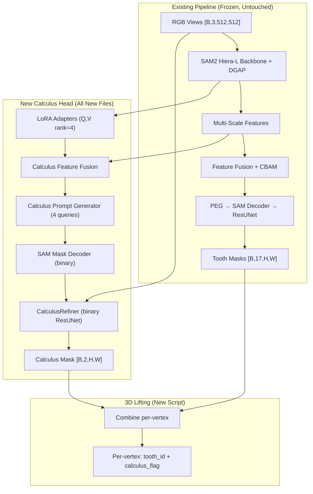

# Calculus Segmentation Head — Architecture Extension Plan

Add a **binary calculus segmentation head** to 3DTeethSAM, trained on 300 synthetic calculus samples. All changes are **new files only** — the existing tooth segmentation pipeline remains untouched.

## Design Rationale

The calculus task is **binary semantic segmentation** (calculus vs. non-calculus), fundamentally different from the existing 17-class tooth instance segmentation. The strategy is:

1. **Reuse** the frozen SAM2 Hiera-L backbone and pre-trained tooth features
2. **Adapt** the backbone with lightweight **LoRA** adapters (rank-4) on Q/V attention projections instead of training new DGAP plugins — LoRA is more parameter-efficient for the small 300-sample dataset
3. **Add** a dedicated `CalculusRefiner` head (lightweight binary ResUNet) that takes SAM features + RGB and outputs a binary calculus mask
4. **Lift** 2D calculus predictions to 3D vertex-level `fault_labels` using the existing multi-view projection infrastructure



> [!IMPORTANT]
> With only **300 synthetic samples** (≈210 train / 45 val / 45 test at 70/15/15 split), aggressive regularization is critical: LoRA rank=4, dropout=0.4, heavy augmentation, weight decay=1e-3, early stopping.

---

## Open Questions

> [!IMPORTANT]
> **Q1: Pre-trained tooth checkpoint path** — Which checkpoint should we load as the frozen backbone? Please provide the path to your best trained 3DTeethSAM checkpoint (e.g., `results/<timestamp>/checkpoints/best_model.pth`). If you don't have one yet, the calculus head can be trained on top of the raw SAM2 weights alone.

> [!IMPORTANT]
> **Q2: Split strategy for 300 samples** — The plan assumes a 70/15/15 random split. Would you prefer a specific patient-level split, or is random OK?

> [!IMPORTANT]
> **Q3: Tooth-conditioned calculus** — Should the calculus head also receive the tooth segmentation masks as input (to localize calculus per-tooth), or should it be fully independent? The independent approach is simpler and proposed by default; tooth-conditioning can be added later.

---

## Proposed Changes

### Component 1: Data Preprocessing

Takes the synthetic `.obj` + `.json` pairs (with `fault_labels`) and renders them into multi-view 2D images + binary calculus GT masks, then packs into HDF5.

---

#### [NEW] [preprocess_calculus.py](file:///d:/GitHub/3DTeethSAM/preprocess/preprocess_calculus.py)

Extends `ToothPreprocessor` logic to render **binary calculus masks** alongside RGB views:
- Reuses the same 7 camera viewpoints and `PyTorch3D` rendering pipeline from [preprocess.py](file:///d:/GitHub/3DTeethSAM/preprocess/preprocess.py)
- Reads `fault_labels` from JSON (per-vertex binary array)
- Rasterizes fault labels to 2D via `MeshRasterizer` → `pix_to_face` → per-face majority vote of `fault_labels`, producing a binary `[H, W]` calculus mask per view
- Outputs `.npz` files containing: `images [N,512,512,3]`, `calculus_masks [N,512,512]` (binary), `tooth_labels [N,16,512,512]` (optional, for context)
- CLI: `python preprocess/preprocess_calculus.py --data_dir synthetic_calculus --save_dir preprocess_calculus_data`

#### [NEW] [hdf5_calculus.py](file:///d:/GitHub/3DTeethSAM/model/dataset/hdf5_calculus.py)

Converts the preprocessed `.npz` calculus files into a single HDF5 file:
- Schema: `images` dataset, `calculus_masks` dataset (binary), `sample_index` JSON
- Auto-generates `training_calculus.txt` / `testing_calculus.txt` split files (70/15/15 patient-level random split)

#### [NEW] [calculus_dataset.py](file:///d:/GitHub/3DTeethSAM/model/dataset/calculus_dataset.py)

`HDF5CalculusDataset(Dataset)` — PyTorch Dataset for calculus training:
- Returns `{'image': [3,H,W], 'calculus_mask': [2,H,W], 'case_name': str, 'view_idx': int}`
- `calculus_mask` channel 0 = background, channel 1 = calculus (one-hot)
- **Heavy augmentation** for small dataset: brightness/contrast jitter (p=0.7), Gaussian noise (p=0.5, σ=0.02), random affine rotation (±10°, p=0.5), random horizontal flip (p=0.5), elastic deformation (p=0.3), color jitter (p=0.5)

---

### Component 2: Model Architecture (New Calculus Head)

All new files under `model/calculus/`. No existing model files are modified.

---

#### [NEW] [\_\_init\_\_.py](file:///d:/GitHub/3DTeethSAM/model/calculus/__init__.py)

Package init, exports `CalculusSegmentationSystem`.

#### [NEW] [lora.py](file:///d:/GitHub/3DTeethSAM/model/calculus/lora.py)

Lightweight **LoRA** (Low-Rank Adaptation) module:

```python
class LoRALinear(nn.Module):
    """LoRA adapter wrapping an existing nn.Linear layer."""
    def __init__(self, original_linear: nn.Linear, rank=4, alpha=1.0):
        # Freezes original weights, adds trainable A (rank x in) and B (out x rank)
        # forward: y = original(x) + (x @ A^T @ B^T) * (alpha / rank)
```

- `inject_lora(model, target_modules=['q_proj', 'v_proj'], rank=4)` — walks SAM2 attention layers, replaces `nn.Linear` Q/V projections with `LoRALinear` wrappers
- `get_lora_params(model)` — returns only LoRA A/B parameters for the optimizer
- `merge_lora(model)` — folds LoRA weights into original weights for inference speedup

Key design: LoRA rank=4 with α=1.0 adds only ~0.3M trainable parameters on the 144M-param Hiera-L backbone, ideal for 300 samples.

#### [NEW] [calculus_head.py](file:///d:/GitHub/3DTeethSAM/model/calculus/calculus_head.py)

`CalculusRefiner(nn.Module)` — A **lightweight binary ResUNet** adapted from [Mask_Refiner.py](file:///d:/GitHub/3DTeethSAM/model/Mask_Refiner.py):

- **Input channels**: RGB image `[B,3,H,W]` + coarse SAM calculus mask `[B,2,H,W]` + SAM embedding `[B,256,64,64]`
- **Architecture**: Same dual-encoder ResUNet structure as existing `ResUNet`, but:
  - Reduced channel widths: `32→64→128→256` (vs `64→128→256→512` in tooth refiner) — halved to prevent overfitting on 300 samples
  - Bottleneck: 512 channels (vs 1024)
  - **Output**: `[B, 2, H, W]` (background + calculus)
  - Dropout: 0.4 (vs 0.3 for teeth)
  - Self-attention only at deepest stage (stage 4)
- Reuses `ConvBnRelu`, `ResidualBlock`, `SelfAttention`, `EncoderBlock`, `DecoderBlock`, `SAMFeatureProcessor`, `FeatureFusionSimple` from [Mask_Refiner.py](file:///d:/GitHub/3DTeethSAM/model/Mask_Refiner.py) via import

#### [NEW] [calculus_prompt_generator.py](file:///d:/GitHub/3DTeethSAM/model/calculus/calculus_prompt_generator.py)

`CalculusPEG(nn.Module)` — Simplified prompt generator for calculus:

- **4 learnable queries** (vs 16 for teeth) — calculus typically appears in 2-6 localized regions along the gumline
- 3-layer Transformer decoder (vs 6 for teeth) — simpler task
- `label_head` outputs calculus presence confidence `[B, 4]`
- Uses the same `MultiLevelFeatureFusion` from [PEGnet.py](file:///d:/GitHub/3DTeethSAM/model/PEGnet.py) via import (shared frozen features)

#### [NEW] [calculus_system.py](file:///d:/GitHub/3DTeethSAM/model/calculus/calculus_system.py)

`CalculusSegmentationSystem(nn.Module)` — End-to-end calculus pipeline:

```python
class CalculusSegmentationSystem(nn.Module):
    def __init__(self, config):
        # 1. Load SAM2 backbone (frozen)
        self.sam_model = build_sam2(...)
        freeze_all(self.sam_model)

        # 2. Inject LoRA into Q/V attention projections
        inject_lora(self.sam_model, rank=config['lora_rank'])

        # 3. Reuse MultiLevelFeatureFusion (frozen, loaded from tooth checkpoint)
        self.feature_fusion = MultiLevelFeatureFusion(d_model=256)

        # 4. New calculus-specific modules (trainable)
        self.calculus_peg = CalculusPEG(d_model=256, num_queries=4)
        self.calculus_refiner = CalculusRefiner(num_classes=2)

    def forward(self, images):
        # Extract features through SAM2 + LoRA
        image_embed, high_res_feats, orig_hw = self.process_images(images)
        seq_features, fused_features = self.feature_fusion(image_embed, high_res_feats)

        # Generate calculus prompts
        prompt_embed, confidence = self.calculus_peg(seq_features)

        # Generate coarse calculus masks via SAM decoder
        sam_masks = self.generate_calculus_masks(prompt_embed, image_embed, high_res_feats, orig_hw)

        # Refine
        refined_masks = self.calculus_refiner(images, torch.sigmoid(sam_masks), fused_features)

        return sam_masks, refined_masks, confidence
```

**Trainable parameters** (estimated):
| Module | Params | Trainable? |
|--------|--------|------------|
| SAM2 Hiera-L backbone | ~144M | Frozen |
| LoRA adapters (Q,V rank=4) | ~0.3M | ✅ |
| MultiLevelFeatureFusion | ~2.5M | Frozen (loaded from tooth ckpt) |
| CalculusPEG (4 queries, 3 layers) | ~1.2M | ✅ |
| CalculusRefiner (half-width ResUNet) | ~4M | ✅ |
| **Total trainable** | **~5.5M** | |

---

### Component 3: Loss Functions

---

#### [NEW] [loss_calculus.py](file:///d:/GitHub/3DTeethSAM/model/loss/loss_calculus.py)

`CalculusLoss(nn.Module)` — Binary segmentation loss:

```python
class CalculusLoss(nn.Module):
    def __init__(self):
        self.bce_weight = 1.5      # BCE on coarse SAM masks
        self.dice_weight = 1.0     # Dice on coarse masks
        self.ce_weight = 1.0       # CE on refined masks
        self.dice_refine = 1.0     # Dice on refined masks
        self.boundary_weight = 0.5 # Boundary loss on refined masks
        self.conf_weight = 0.5     # Confidence BCE
        self.focal_gamma = 2.0     # Focal loss modulation for class imbalance

    def forward(self, sam_masks, refined_masks, confidence, gt_masks):
        # Handles severe class imbalance (calculus << background)
        # Uses focal loss variant of BCE + soft Dice + boundary
```

Key considerations for calculus:
- **Class imbalance**: Calculus covers ~5-15% of tooth surface → use focal loss (γ=2) and Dice
- **Boundary sharpness**: Reuses `DifferentiableBoundaryLoss` from [lossall.py](file:///d:/GitHub/3DTeethSAM/model/loss/lossall.py) via import
- **Uncertainty weighting**: Learnable log-variance balancing between stages (imported from `lossall.py`)

---

### Component 4: Configuration

---

#### [NEW] [config_calculus.py](file:///d:/GitHub/3DTeethSAM/config/config_calculus.py)

```python
def get_calculus_config():
    return {
        # Data
        'data_dir': 'preprocess_calculus_data',
        'h5_path': 'preprocess_calculus_data/h5/calculus_dataset.h5',
        'train_split_path': 'preprocess/split/calculus/training_calculus.txt',
        'val_split_path': 'preprocess/split/calculus/testing_calculus.txt',

        # Architecture
        'embed_dim': 256,
        'num_calculus_queries': 4,
        'num_classes': 2,           # background + calculus
        'lora_rank': 4,
        'lora_alpha': 1.0,
        'calculus_peg_layers': 3,
        'dropout_rate': 0.4,        # Higher for small dataset

        # Training
        'batch_size': 4,
        'epochs': 80,
        'learning_rate': 5e-4,
        'lora_lr': 1e-4,
        'weight_decay': 1e-3,       # Stronger regularization
        'warmup_epochs': 8,
        'grad_clip': 1.0,
        'focal_gamma': 2.0,

        # Backbone
        'sam_config': 'sam2.1_hiera_l.yaml',
        'sam_checkpoint': 'model/sam2/checkpoints/sam2.1_hiera_large.pt',
        'tooth_checkpoint': None,    # Path to pre-trained tooth model (optional)
        'finetune_sam': False,

        # AMP
        'use_amp': True,
        'amp_dtype': 'bfloat16',
        'view_indices': [0, 1, 2, 3, 4, 5, 6],
    }
```

---

### Component 5: Training Pipeline

---

#### [NEW] [train_calculus.py](file:///d:/GitHub/3DTeethSAM/train_calculus.py)

Single-stage training script (no Hungarian matching needed — binary task):

- Loads `CalculusSegmentationSystem` with frozen SAM2 + LoRA + calculus head
- Optionally loads pre-trained tooth checkpoint to initialize `feature_fusion` weights
- Optimizer: AdamW with param groups `[{lora_params, lr=1e-4}, {calculus_head_params, lr=5e-4}]`
- Scheduler: `LinearWarmupCosineAnnealingLR` (8 warmup epochs, 80 total)
- Early stopping: patience=15 on validation Dice
- Saves best model to `results_calculus/<timestamp>/checkpoints/best_calculus_model.pth`
- TensorBoard logging of loss components, Dice, IoU, sample predictions

#### [NEW] [trainer_calculus.py](file:///d:/GitHub/3DTeethSAM/model/trainer_calculus.py)

`CalculusTrainer` class — follows same structure as [trainer.py](file:///d:/GitHub/3DTeethSAM/model/trainer.py) but simplified:
- `setup_data()` — uses `HDF5CalculusDataset`
- `setup_model()` — uses `CalculusSegmentationSystem` + `CalculusLoss`
- `train_one_epoch()` — forward → loss → backward with AMP
- `validate()` — Dice, IoU, precision, recall on binary calculus mask
- `test()` — saves predicted 2D calculus masks as visualization
- No Stage 2 / Hungarian matching (not needed for binary segmentation)

---

### Component 6: Inference & Evaluation

---

#### [NEW] [inference_calculus.py](file:///d:/GitHub/3DTeethSAM/inference_calculus.py)

End-to-end 3D calculus detection pipeline:
1. Load 3D mesh (`.obj`) + labels (`.json`)
2. Render multi-view RGB images (reuses `Projector` views from [lift3d.py](file:///d:/GitHub/3DTeethSAM/lift/lift3d.py))
3. Run `CalculusSegmentationSystem` → 2D binary calculus masks per view
4. **Lift to 3D**: Back-project 2D calculus probabilities to mesh vertices via `Projector` + depth-weighted voting (same mechanism as tooth lifting)
5. Output per-vertex `fault_labels` (0/1) saved to `inference_results/calculus/<case>.json`
6. Optional: overlay calculus regions on the tooth segmentation for combined output

#### [NEW] [evaluate_calculus.py](file:///d:/GitHub/3DTeethSAM/evaluate_calculus.py)

3D mesh-level evaluation metrics for calculus:
- **Vertex Dice**: Per-vertex Dice between predicted and GT `fault_labels`
- **Vertex IoU**: IoU on calculus vertex set
- **Precision / Recall**: For clinical relevance (false negatives are worse)
- **Boundary IoU**: 3D boundary quality at calculus margins (reuses `get_boundary_vertices_knn` logic from [evaluate_metrics.py](file:///d:/GitHub/3DTeethSAM/evaluate_metrics.py))
- **Per-tooth calculus detection**: Cross-references with tooth labels to report calculus detection per tooth

---

### Component 7: Split Files

---

#### [NEW] [preprocess/split/calculus/](file:///d:/GitHub/3DTeethSAM/preprocess/split/calculus/)

- `training_calculus.txt` — ~210 case names (70%)
- `testing_calculus.txt` — ~45 case names (15% val + 15% test)

Auto-generated by `hdf5_calculus.py` based on patient-level random split with seed=42.

---

## File Summary

| # | File | Type | Purpose |
|---|------|------|---------|
| 1 | `preprocess/preprocess_calculus.py` | NEW | Render synthetic meshes → multi-view RGB + binary calculus masks |
| 2 | `model/dataset/hdf5_calculus.py` | NEW | Pack .npz → HDF5 + auto-generate splits |
| 3 | `model/dataset/calculus_dataset.py` | NEW | PyTorch Dataset with heavy augmentation |
| 4 | `model/calculus/__init__.py` | NEW | Package init |
| 5 | `model/calculus/lora.py` | NEW | LoRA adapter for SAM2 attention layers |
| 6 | `model/calculus/calculus_head.py` | NEW | Binary CalculusRefiner (lightweight ResUNet) |
| 7 | `model/calculus/calculus_prompt_generator.py` | NEW | CalculusPEG (4 queries, 3-layer Transformer decoder) |
| 8 | `model/calculus/calculus_system.py` | NEW | End-to-end CalculusSegmentationSystem |
| 9 | `model/loss/loss_calculus.py` | NEW | Focal BCE + Dice + Boundary loss |
| 10 | `config/config_calculus.py` | NEW | Calculus training configuration |
| 11 | `train_calculus.py` | NEW | Training entrypoint |
| 12 | `model/trainer_calculus.py` | NEW | CalculusTrainer class |
| 13 | `inference_calculus.py` | NEW | 3D calculus inference pipeline |
| 14 | `evaluate_calculus.py` | NEW | 3D calculus evaluation metrics |
| 15 | `preprocess/split/calculus/*.txt` | NEW | Train/test split files |

> [!NOTE]
> **Zero existing files modified.** All 15 entries are new files. The existing tooth segmentation pipeline is completely preserved.

---

## Training Workflow (User Steps)

```bash
# Step 1: Synthetic data is already generating
# (running: python scripts/generate_synthetic_dataset.py ...)

# Step 2: Preprocess synthetic meshes → multi-view renderings
python preprocess/preprocess_calculus.py \
    --data_dir synthetic_calculus \
    --save_dir preprocess_calculus_data

# Step 3: Train calculus head
python train_calculus.py \
    --tooth_checkpoint results/<timestamp>/checkpoints/best_model.pth

# Step 4: Run inference
python inference_calculus.py \
    --input_dir teeth3ds_sample \
    --checkpoint results_calculus/<timestamp>/checkpoints/best_calculus_model.pth

# Step 5: Evaluate
python evaluate_calculus.py \
    --pred_dir inference_results/calculus \
    --gt_dir synthetic_calculus
```

---

## Verification Plan

### Automated Tests
```bash
# 1. Preprocessing sanity check — verify .npz outputs
python preprocess/preprocess_calculus.py --data_dir synthetic_calculus --save_dir preprocess_calculus_data

# 2. Dataset loading — verify shapes
python -c "from model.dataset.calculus_dataset import HDF5CalculusDataset; d = HDF5CalculusDataset('preprocess_calculus_data/h5/calculus_dataset.h5', split_file_path='preprocess/split/calculus/training_calculus.txt'); print(len(d), d[0]['image'].shape, d[0]['calculus_mask'].shape)"

# 3. Model forward pass — verify output shapes
python -c "
from model.calculus.calculus_system import CalculusSegmentationSystem
from config.config_calculus import get_calculus_config
import torch
m = CalculusSegmentationSystem(get_calculus_config()).cuda()
x = torch.randn(2, 3, 512, 512).cuda()
sam, ref, conf = m(x)
print(sam.shape, ref.shape, conf.shape)
# Expected: [2,2,512,512], [2,2,512,512], [2,4]
"

# 4. Training — verify loss decreases for 5 epochs
python train_calculus.py --epochs 5 --batch_size 2

# 5. Full training run
python train_calculus.py

# 6. Evaluation
python evaluate_calculus.py --pred_dir inference_results/calculus --gt_dir synthetic_calculus
```

### Manual Verification
- Visually inspect 2D calculus mask predictions overlaid on rendered views
- Use `scripts/visualize_gui.py` to verify 3D calculus vertex predictions on meshes
- Compare predicted calculus regions with ground-truth `fault_labels` in `Synthetic_Data_Viewer.ipynb`
